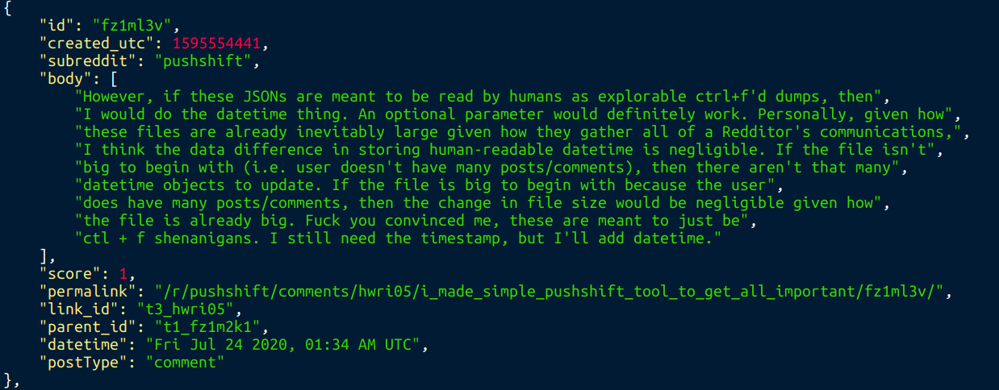

# redditsfinder - A simple tool to analyze reddit users
 
## The only argument is a reddit username. 
## **The goal of this program is ease of use and correctly grabbing every post.** 

# Installation 
**Make sure you have python3 installed**.\
***Linux one line install*** \
`wget -O - https://raw.githubusercontent.com/Fitzy1293/redditsfinder/master/install.sh | bash`

***Windows & Mac***\
Copy and paste the code from push.py wherever you want. 

# How to use
If you did the full linux install. `redditsfinder[redditUsername]` \
If you only ran the first linux install command or are on Windows or Mac. `python3 push.py [redditUsername]` \
Make sure you're in the redditsfinder directory for the python interpreter way.

**Example terminal output**\

