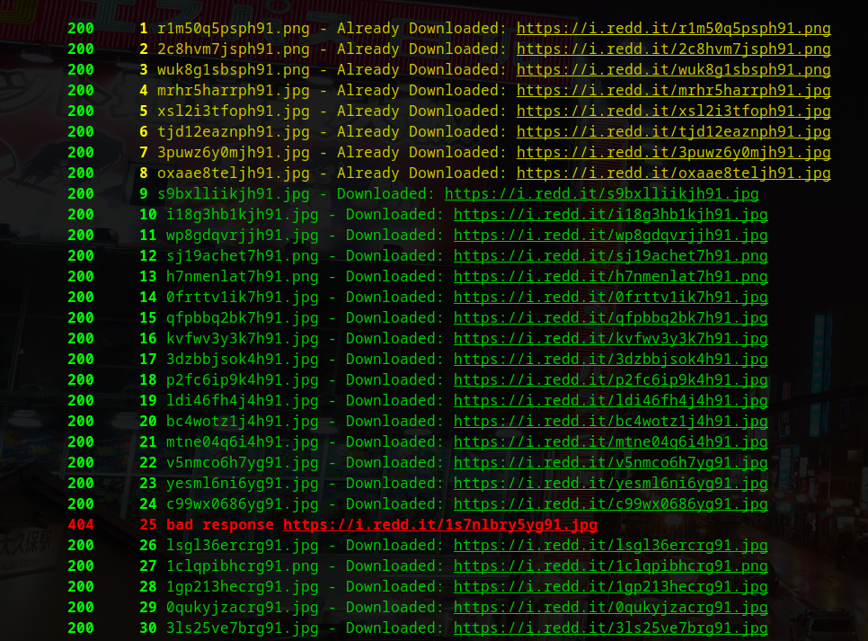
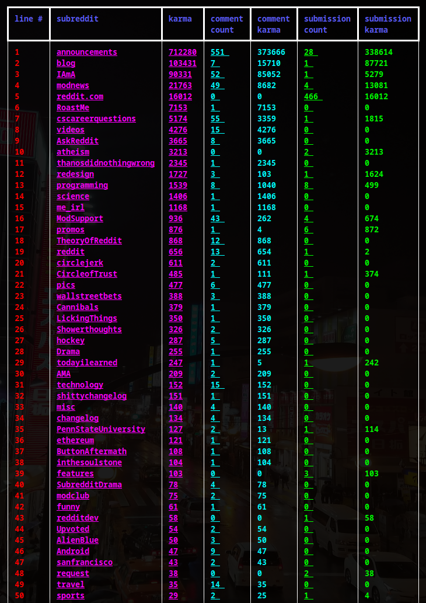

# redditsfinder - reddit user info

It's in a good state again with some quality of life improvements. 

**`pip3 install redditsfinder`**

**A program to get reddit user post data.**

```
Running redditsfinder
---------------------
    Test it on yourself to make sure it works.
        redditsfinder someusername

    Basic usage
        redditsfinder username
        redditsfinder [options] username_0 username_1 username_2 ...

    With an input file
        -f or --file.
        redditsfinder [options] -f line_separated_text_file.txt

    Examples
        - just print the summary table to stdout
            $ redditsfinder someusername

        - save data locally and print the summary table to stdout
            $ redditsfinder --write someusername

        - just save data locally without printing
            $ redditsfinder --write --quiet someusername

        - download pictures
            $ redditsfinder -pd someusername

    Optional args
        --pics returns URLs of image uploads
        -pd or --pics --download downloads them
            -quiet or -q turns off printing

```

# Demo

## Downloading Images

`redditsfinder -pd someusername`



## Creating a command 

`redditsfinder someusername`



